# CreatureCreator Deep Decomposition / Ownership Audit

**Report ID:** `CCAUD-20260912-DEEP-4F91C7A2`
**Date:** 2026-09-12
**Branch:** `audit/skeleton-animation-improvements-2026-09-07`

## Scope

Follow-up architectural audit after the 750-round lean-safety/successor review. Focus: ownership boundaries, snapshot immutability, repeated resolution, raw-vs-resolved leakage, Unity assembly coupling, and coordinator decomposition.

## Findings

### P1 — Snapshot boundaries are not actually immutable

`CreatureHierarchyIndex` exposes read-only interfaces backed by mutable `List<T>` instances. `ResolvedCreatureSnapshot.BodyFrames` is backed by a mutable array. `GeneratedCreatureData.MeshResult` remains mutable after handoff, while `GenerationDiagnostics` is mutated across the asynchronous boundary. These types are documented or used as snapshot/handoff seams, so the current API permits post-publication mutation.

**Consequence:** downstream stages cannot reliably treat generation inputs/results as stable transactions; cache keys and deterministic reasoning become weaker.

**Recommended direction:** use immutable arrays/read-only immutable data at the seam. Do not rely on `IReadOnlyList<T>` alone when the concrete backing collection remains mutable.

### P1 — Resolved limb state transitively exposes mutable authoring data

`ResolvedLimb.Thickness` points at `ThicknessProfile`, whose serialized `Keys` list is mutable and whose `Quantize()` mutates that list in place.

**Recommended direction:** resolve authoring thickness into a small immutable runtime representation. Keep `ThicknessProfile` an authoring model only.

### P1 — Generation still reaches raw DNA during Unity mesh assembly

`CreatureMeshGenerator.AppendMeshAssetItems` resolves a part from the immutable snapshot and then performs a second raw `CreatureDefinition.FindPart(...)` lookup solely to call rigid mesh weight authoring. This reopens mutable authoring state after generation resolution.

**Recommended direction:** narrow `RigidMeshWeightAuthoring.Author(...)` to generation-owned semantic inputs (for example part identity / limb status / mirror policy) and remove the raw-definition lookup from assembly.

### P1 — Normal hierarchy resolution repeatedly rebuilds indexes

`CreatureDefinition.FindPart`, `GetChildren`, and `HasParentCycle` each build a new `CreaturePartHierarchyIndex`. Snapshot construction also invokes definition-level lookup while resolving parent chains.

**Consequence:** repeated allocation/work and repeated interpretation of the same hierarchy inside one generation transaction.

**Recommended direction:** construct one request-local hierarchy context during canonicalization/resolution and pass it through parent-before-child frame resolution. Do not add a mutable cache to `CreatureDefinition`.

### P1 — Body child anchoring can re-resolve already-resolved body state

The snapshot path can re-enter body resolution while processing child anchors even though a resolved body is already available in the same transaction.

**Recommended direction:** make resolved body state an explicit input to anchor resolution so body semantics are evaluated once per request.

### P1 — Skeleton inference fallback masks ordinary resolution failures

`SkeletonInferrer.Infer(CreatureDefinition)` historically catches any `DomainException` and falls back to malformed-definition inference. This can turn ordinary resolution failures into apparently valid skeleton output.

**Recommended direction:** distinguish explicit malformed-DNA diagnostics from unexpected resolution failure; fail closed for the latter.

### P1 — Coordinator breadth remains high

`CreatureMeshGenerator` coordinates definition validation/resolution, field compilation, sampling/extraction, appearance, skeleton inference, influence-domain resolution, validation, and Unity assembly.

**Recommended direction:** retain a single orchestration entry point, but introduce a small request-scoped generation context/pipeline that owns resolved inputs and compiled field artifacts. Keep Unity object creation in a thin assembly façade.

### P2 — Legacy preview/binding path remains a second computation pipeline

The compatibility preview binding path can recompute data that the generation pipeline has already established.

**Recommended direction:** instrument the compatibility path, make production use observable, then converge it onto generated immutable artifacts before deleting it.

### P2 — Completion failure can be silently discarded

`CreaturePreviewController.ProcessCompletions` catches `DomainException` from revision resolution and clears the request without preserving a generation failure result.

**Recommended direction:** convert the exception into an explicit failed completion/diagnostic state so failures remain visible to the caller and telemetry.

### P2 — Diagnostics success semantics are vulnerable at transaction boundaries

Success is inferred from `FailedStage == null`, while later work can fail after a stage timer has already completed.

**Recommended direction:** construct mutable diagnostics during generation, then freeze them into an immutable result only after the whole transaction succeeds or a failure has been recorded.

### P2 — Convenience APIs can accidentally trigger duplicate compilation/resolution

Compatibility overloads such as appearance baking and influence-domain resolution accept raw `CreatureDefinition` and internally compile/resolve again, while production overloads already accept request-scoped compiled programs.

**Recommended direction:** make raw overloads explicit compatibility adapters and prevent them from being the normal generation path.

### P2 — Name-based Unity cleanup ownership is broader than generated ownership

Rig/renderer cleanup paths use names/prefixes such as `Bone_` and exact generated names. This can remove unrelated user-authored children if names collide.

**Recommended direction:** track generated objects/components explicitly and destroy only tracked ownership. Treat names as presentation, not identity.

### P2 — Mutable resolved appearances remain a seam risk

Resolved snapshot data includes appearance references whose mutability is not as strong as `ResolvedPolyline`-style copied immutable collections.

**Recommended direction:** copy/normalize runtime appearance state during resolution and expose immutable runtime data.

### P3 — Cycle checking can be consolidated with hierarchy resolution

Repeated ancestor walks are correct but can duplicate work.

**Recommended direction:** defer optimization until the request-local hierarchy context exists; then perform cycle detection and parent resolution from the same graph representation.

## Lean target architecture

```mermaid
flowchart LR
    D[CreatureDefinition] --> V[Validate + Canonicalize]
    V --> H[Request-local hierarchy context]
    H --> R[ResolvedCreatureSnapshot]
    R --> Q[Immutable GenerationRequest]
    Q --> C[Request-scoped compiled field context]
    C --> G[Mesh / Appearance / Influence / Skeleton stages]
    G --> A[Immutable GeneratedCreatureData]
    A --> U[Thin Unity assembly]
```

The important boundary is not a forest of services. It is a small number of stable data seams: canonical definition, resolved snapshot, request-scoped compiled context, and immutable generated output.

## Recommended implementation order

1. Close snapshot mutability leaks (`BodyFrames`, hierarchy views, resolved thickness, mesh result, diagnostics).
2. Remove raw `FindPart` from Unity assembly by narrowing rigid-weight authoring inputs.
3. Introduce one request-local hierarchy context and stop rebuilding hierarchy indexes in generation loops.
4. Make body anchoring consume the already-resolved body.
5. Make skeleton inference fail closed except for explicitly classified malformed-input handling.
6. Converge/quarantine compatibility pipelines and raw compile overloads.
7. Add cooperative cancellation and immutable request policy identity.
8. Only after ownership/correctness is stable, evaluate MeshData, DQS, or more advanced deformation work.

## Validation status

This audit is source-grounded. Unity 6000.5.9f1 compilation/tests were not available in this environment, so runtime/compile claims remain unverified until the repository validation gate is run.

## Confidence / residual risk

Overall confidence: **high** for the ownership/API findings because they are direct consequences of the inspected type and call structure. Residual risk: Unity editor lifecycle, Burst/job scheduling, and actual runtime mutation behavior still require whole-project validation and focused tests.
