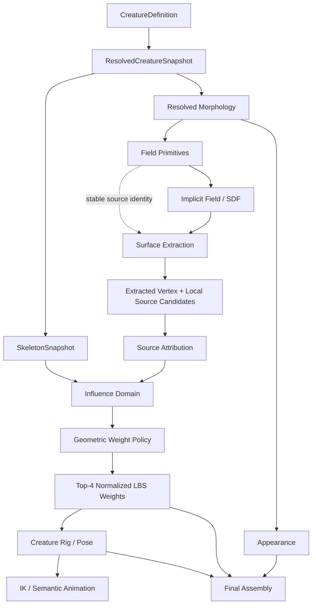

# CreatureCreator — Spore-Style Reference Deep-Dive & Multi-Perspective Peer Review Audit

**Report ID:** `CCAUD-20260912-SPORE-REF-7C2E4A91`

**Date:** 2026-09-12

**Audited branch:** `audit/skeleton-animation-improvements-2026-09-07`

**Audited HEAD:** `f7dd93456092e2068ad4fee784c6ce7ba4a8632e`

**HEAD commit:** `Add tunable, chain-aware skinning weight policy and live editor controls`

**Scope:** External research synthesis + current-branch architectural/design audit. No implementation changes. No task-system mutations.

**Method:** Source-graph crawl, primary-source verification where available, comparison against the two supplied research memos, current-branch source inspection, and repeated review through independent engineering perspectives. Recommendations are deliberately separated from claims directly supported by external sources.

---

## Executive Summary

This audit agrees with most of the repository agent's correction of the earlier research, but reaches a more specific conclusion about the direction of the current branch.

The current CreatureCreator architecture is **already much closer to the useful parts of Spore than the raw symptom list suggests**. It has a compact authoritative definition, a resolved morphology snapshot, an implicit surface, an explicit skeleton, semantic bone resolution, constrained IK/FABRIK infrastructure, morphology-aware appearance, deterministic generation mechanisms, and a growing separation between pure generation and Unity assembly. The latest branch commit adds a real `InfluenceWeightingPolicy` and a chain-aware longitudinal gate, making the immediate skinning problem tunable and substantially better constrained.

The important research conclusion is therefore *not* “rebuild the creature system around Spore.” It is:

> **Make source ownership of the implicit body a first-class concept before adding more geometric weight heuristics.**

The latest weighting pass is a good **local deformation heuristic**, but it still answers the question “which nearby bone should influence this vertex?” from final geometry and domain restrictions. Spore's published explanation answers a different question first: **which body parts generated the field that became this surface?** That distinction matters precisely at elbows, hocks, shoulders, torso transitions, and merged limbs—the locations where spatial proximity becomes ambiguous.

The supplied research memos correctly identified this distinction. This audit sharpens it in two ways:

1. **Do not jump straight to top-K provenance stored at every scalar-field sample.** That is conceptually attractive but creates a potentially expensive bandwidth/memory contract in the highest-volume stage of the pipeline.
2. Prefer a **late-binding provenance strategy** initially: preserve stable source identity at the field-primitive/operation level and recover/aggregate local source contributions at final extracted vertices (or extraction-local candidates) using the same field semantics. This can give most of the architectural benefit without turning every voxel into a rich attribution record.

A second major conclusion is that the new `InfluenceWeightingPolicy` creates a hidden identity/configuration issue that should be treated seriously. `ResolvedCreatureSnapshot.RevisionId` is derived from canonical creature definition data, while the weighting policy lives on `CreatureGenerationConfig` and is therefore outside that revision hash. The policy can alter generated skin weights without changing the snapshot revision. That is acceptable only if weights are explicitly treated as a post-snapshot, non-identity-bearing bind artifact. If the pipeline later caches, serializes, compares, or accepts generated outputs using `RevisionId`, the policy becomes an untracked generation input. This boundary should be made explicit before the policy grows further.

The external references also argue against over-generalizing the system:

- **Spore** validates a hybrid architecture: procedural continuous body + authored rigblocks/details, rather than procedural everything.
- **Strange Seed** is a useful production counterexample: standardized authored parts can deliberately avoid the hardest arbitrary-skinning problems.
- **The Sapling** is strongest for population-scale procedural locomotion, rebuild discipline, and optimization rather than exact Spore-like skinning.
- **Elysian Eclipse** shows a small-team path built from parts, morphs, attachment, and editor affordances, plus explicit performance/complexity feedback.
- **Critter Crosser / Cross Breeder X** is the strongest new research chain for understanding source-part identity across procedural construction, breeding, and organic rendering, but claims about its internal mechanism must be treated as unverified until the videos are transcribed/inspected directly.
- **Rune Skovbo Johansen's procedural-creature work** is the strongest caution against turning arbitrary low-level parameters and tuning knobs into “plausibility.” Meaningful, correlated high-level representations matter.

The recommended direction is consequently:

```text
Authoritative creature definition
        |
        v
Resolved morphology / stable source identity
        |
        +----------------------+
        |                      |
        v                      v
Implicit field          Skeleton / anatomy
        |                      |
        +----------+-----------+
                   |
                   v
       Surface extraction
                   |
                   v
       Local source attribution
                   |
          +--------+--------+
          |                 |
          v                 v
   anatomical domains   local weight profile
          |                 |
          +--------+--------+
                   |
                   v
             final LBS weights
                   |
                   v
             animation / IK
```

The key design principle is that **provenance constrains the candidate set; geometry remains useful for local weighting inside that set**. This preserves the strengths of the current code instead of replacing it wholesale.

---

# 1. What Was Audited

## 1.1 Inputs

This audit combines three evidence classes:

### A. Supplied research memos

The first memo is a follow-up research intake focused on The Sapling, Critter Crosser, Strange Seed, and a refined TSK-0222 hypothesis. It explicitly corrects earlier overstatements around `daniellochner/creature`, Spore animation, and the status of Compact Isocontours, then centers the investigation on source provenance and deformation weighting.

The strongest common conclusion in those memos is that provenance and deformation must be considered separately from IK. The first memo states the refined research target as preserving source-field attribution through evaluation, extraction, vertex adjustment, welding, and assembly, then deriving eligible bones from that attribution. It also correctly warns that provenance is not automatically the final bone weight; a local weighting profile still has to be applied.

The second memo is a broad Spore/Unity research map covering the creature recipe, implicit surface, rigblocks, bone weights, semantic animation, texturing, open-source references, Unity implementation routes, and a large external reference list.

### B. Independent web research

The external crawl revisited primary and near-primary sources including:

- Chris Hecker's *My Liner Notes for Spore*.
- Chris Hecker's motion-retargeting paper and presentation material.
- The Compact Isocontours literature.
- Alex Christo's Unity-oriented procedural creature dissertation/project.
- Strange Seed development logs.
- The Sapling development logs, including procedural walking and large-scale optimization.
- Elysian Eclipse's development archive and current site/wiki links.
- Critter Crosser / Cross Breeder X developer-channel archives and secondary references where direct indexing was incomplete.
- Automatic-skinning references such as Surface Heat Diffuse Skinning and ASMR as counterpoints.
- Contemporary procedural creature work by Rune Skovbo Johansen.

### C. Current branch source inspection

Current HEAD was verified through GitHub before the audit. The branch has advanced since the previous exhaustive code-health review and now contains a concrete weighting-policy change.

Current runtime source areas include Animation, Appearance, Common, Definition, Generation, Morphology, Serialization, Skeleton, and their extraction/SDF submodules. The generation area contains `CreatureGenerationConfig`, `CreatureMeshGenerator`, `CreatureRuntimePreview`, `GeneratedCreatureData`, and diagnostics; the skeleton area contains `SkeletonInferrer`, `SkeletonSnapshot`, `SemanticBoneResolver`, and the anatomical rig layout; the extraction path contains `DensityGrid`, `MarchingCubesExtractor`, topology validation, and integrity fingerprints.

---

# 2. Research Corrections That Survived Peer Review

## 2.1 `daniellochner/creature` must not be cited as an implementation reference

The supplied agent review is correct. The public repository is effectively a pointer/readme/license artifact and should not be described as evidence of a concrete modular-limb implementation. The full-game repository referenced by its README is the more interesting target, but source existence and current accessibility must be independently confirmed before architectural claims are based on it.

**Disposition:** Confirmed correction.

## 2.2 Spore animation was not a creature biomechanics simulator

The supplied correction is also correct. The useful published model is morphology-independent authored motion/intent resolved against the current creature into pose goals and constrained IK behavior. Chris Hecker's published motion-retargeting work is directly about adapting animation to highly varied user-created morphologies, not deriving an arbitrary organism's physical laws at runtime.

This matters because it prevents the project from importing a false architectural premise such as “Spore solved arbitrary creatures with full physical reasoning.” It did not need to.

**Disposition:** Confirmed correction.

## 2.3 Compact Isocontours is not a wholesale replacement for this repository's mesher

The current repository already contains Marching Cubes plus an Asymptotic Decider. The useful external question is whether the Compact Isocontours/Mesh Displacement idea provides a post-extraction quality improvement or a local vertex-adjustment technique compatible with the existing topology/provenance contract.

**Disposition:** Keep this as a geometry-quality research seam, not a new mesher replacement project.

## 2.4 “Nearest bone” is not the same thing as anatomical ownership

This is the central correction and the highest-value finding.

The latest branch weighting code computes segment falloff in final-space geometry. `ImplicitSurfaceInfluenceDomainResolver` already constrains each vertex to a hierarchy-derived domain. `ImplicitSurfaceWeightAuthoring` then computes candidate weights against bone segments and limits chain spread. That is materially better than the old unrestricted nearest-segment model.

But it remains an inference from geometry. The field itself contains more information than the final vertex location: it was generated from source morphological structures. Once that source identity disappears, later stages cannot reconstruct it perfectly from distance alone.

Spore's published description is useful precisely because its skin weights were derived from which body parts generated the metaballs, not solely from post-hoc proximity. Chris Hecker's liner notes also acknowledge difficult torso and torso-attached cases; the reference is valuable without pretending it is perfect.

**Disposition:** Confirmed structural distinction; current heuristic is a valid interim mechanism, not the final ownership model.

---

# 3. The Current Branch Has Already Moved the Design Forward

The latest branch commit should not be reviewed as if it were still the old hard-coded system.

`InfluenceWeightingPolicy` now packages:

- influence radius scale,
- falloff power,
- fallback bone radius,
- chain-aware locality enablement,
- endpoint blend-band size.

The policy is a value type with explicit validation and defaults. Its default is chain-aware, with a one-radius endpoint blend band.

The generation config exposes these values to the editor and reconstructs a clamped policy value for consumers.

The weight authoring path now:

1. restricts candidates by resolved influence domain;
2. computes radial falloff;
3. optionally applies a longitudinal span gate;
4. tries an ungated radial fallback if the gate would leave a vertex unweighted;
5. has a nearest-admitted-segment final totality guard if the resolved domain still contains no falloff candidate;
6. sorts candidates by weight and bone index;
7. takes up to the LBS maximum and normalizes.

This is a meaningful improvement because it reduces two failure classes:

- a child bone reaching backwards along a chain into an upstream segment;
- cross-chain leakage when a surface point is close to unrelated or opposite-side geometry.

The branch is therefore **not blocked on the absence of tunability or locality controls**. The next question is whether more tunability is the correct way forward.

---

# 4. Multi-Perspective Peer Review

The following passes were intentionally treated as independent review lenses. A recommendation was kept only when it survived multiple incompatible ways of looking at the system.

---

## Perspective 1 — Historical-Fidelity Review

### Question
Are we importing what Spore actually did, or a community mythology about Spore?

### Findings

- The supplied correction that Spore's animation architecture was morphology-independent authoring + semantic resolution + pose goals + constrained IK is supported by the published animation material.
- The published bone-weight explanation is significantly more relevant to current deformation defects than broad animation discussion.
- Rigblocks demonstrate a hybrid principle: procedural body generation was paired with authored detail geometry rather than forcing every visible element through a procedural surface.
- Spore's own limitations matter. Published notes do not justify claiming perfect torso/attachment deformation.

### Recommendation
Use Spore as a **set of mechanisms and tradeoffs**, not a monolithic architecture to reproduce.

**Confidence:** High.

---

## Perspective 2 — Field-Mathematics Review

### Question
Where does information actually exist in the scalar-field pipeline?

### Findings

The repository has an explicit SDF program builder/evaluator path and a separate `LimbMetaballSampler`. The critical architectural question is whether the field is a sum of identifiable primitive contributions, a sequence of smooth-union operations, or a mixture. A provenance system cannot assume “weight of primitive i” means the same thing under all composition operators.

### Recommendation
Before designing provenance payloads, specify the **field composition semantics**:

```text
primitive potential
      |
      +---- additive contribution?
      |
      +---- smooth-min contribution?
      |
      +---- transformed/boolean operation?
```

A source-attribution API must mirror the actual field semantics. Do not define `sourceContribution` generically until the aggregator is mathematically specified.

**Confidence:** High.

---

## Perspective 3 — Provenance/Data-Lineage Review

### Question
What is the smallest stable identity that survives generation?

### Findings

The supplied memo proposes a rich `PrimitiveSource` record and potentially top-K attribution at every field sample. That is directionally sound, but it risks making the dense sampling stage carry high-cardinality metadata simply because downstream weighting wants provenance.

The more economical observation is that the identity already begins upstream, at the generated limb/body primitive. The right abstraction is likely a stable source key such as:

```text
MorphologySourceId
  -> anatomical part
  -> generated limb / body sample
  -> chain / side / semantic role
  -> corresponding bone identity
```

That source key can travel with the primitive representation without automatically becoming a dense voxel payload.

### Recommendation
Define provenance first at the **primitive representation boundary**, not at the scalar sample boundary.

**Confidence:** High.

---

## Perspective 4 — Memory/Performance Review

### Question
Would the obvious provenance design damage the hot path?

### Findings

The naive design in the supplied memo—top-K source IDs and contributions on every scalar sample—would increase memory bandwidth and storage approximately with:

`gridSamples × K × (source-id + weight metadata)`.

That is exactly the wrong location to casually add metadata because dense field sampling is one of the most frequently repeated, bandwidth-sensitive steps in this repository.

The Sapling's optimization post provides a useful independent production lesson: full 3D organism construction is expensive, avoiding duplicate work matters, and caching/pooling/prebuilt representations can change the economics dramatically.

### Recommendation
Prefer **late binding** of provenance:

```text
stable primitive sources
        |
        v
surface extraction
        |
        v
extracted vertex position
        |
        +--> local source-candidate query
        |
        v
evaluate local field contributions
        |
        v
source contribution aggregation
        |
        v
final weights
```

Only move attribution into dense sampling if profiling demonstrates that final-vertex reconstruction is materially slower or semantically insufficient.

**Confidence:** High.

---

## Perspective 5 — Deformation / Skinning Review

### Question
Will provenance actually repair elbow/foot/tail symptoms?

### Findings

Yes, plausibly—but only if it changes **candidate eligibility**, not merely the numerical weight curve.

The current policy changes the curve and the longitudinal candidate extent. The current final totality fallbacks can deliberately reintroduce the unrestricted radial model when the gate removes all candidates, and the domain-level final fallback chooses the nearest admitted segment.

That is defensible for totality, but it means the current system can still say, in effect:

> “I don't know the source owner, so I will choose the least-bad geometrically allowed bone.”

At difficult joints, that is exactly the ambiguity the provenance proposal is intended to eliminate.

### Recommendation
Do not delete the current geometric weighting model. Reposition it as:

```text
provenance/domain eligibility
        ↓
local geometric weighting
```

not:

```text
geometry
        ↓
ownership
```

**Confidence:** High.

---

## Perspective 6 — Domain-Semantics Review

### Question
Is `InfluenceDomain` already the beginning of a better ownership model?

### Findings

Yes. `ImplicitSurfaceInfluenceDomainResolver` explicitly derives a hierarchy-aware domain from resolved geometry and extends eligibility through non-Body ancestors while excluding sibling/opposite-side chains. That is an important existing seam, not disposable legacy code.

But the domain is still **post-hoc geometry-to-part correspondence**. A final surface vertex can be nearest to a part without having been generated primarily by that part.

### Recommendation
Promote the conceptual model from:

`nearest part -> allowed bones`

to:

`source contributors -> anatomical domain -> allowed bones`

while retaining nearest-part correspondence as a fallback/diagnostic path.

**Confidence:** High.

---

## Perspective 7 — Topology / Welding Review

### Question
Does source provenance survive the topology machinery?

### Findings

The repository already has explicit extraction stages, topology validation, and mesh integrity fingerprints. Welding is therefore a very important seam. If two geometrically equal vertices merge and the winner's metadata is selected by insertion order, any source attribution becomes nondeterministic or semantically biased.

The supplied research memo correctly identifies welding as the critical decision point.

### Recommendation
Treat provenance merge as an explicit algebra:

```text
candidate vertex A: sources + weights
candidate vertex B: sources + weights
                    |
                    v
          deterministic aggregation
                    |
                    v
         normalized representative
```

Do not let source identity be a side effect of the mesh deduplication dictionary.

**Confidence:** High.

---

## Perspective 8 — Determinism / Caching Review

### Question
What does the new policy mean for generation identity?

### Finding — important

`ResolvedCreatureSnapshot.RevisionId` is computed by canonicalizing the creature definition and hashing the canonical JSON representation. The current `InfluenceWeightingPolicy` instead lives on `CreatureGenerationConfig`, external to the creature definition.

Therefore:

```text
same CreatureDefinition
      +
policy A
      -> RevisionId R

same CreatureDefinition
      +
policy B
      -> RevisionId R
```

while the generated LBS weights can differ.

This is not automatically a bug. It becomes a bug when any cache, preview acceptance, serialized generated artifact, benchmark record, or “same revision” test assumes that `RevisionId` identifies all output-affecting generation inputs.

### Recommendation
Make the boundary explicit. Choose one of two policies:

**A. Snapshot identity excludes binding policy by design.**
Document and enforce that `RevisionId` means “resolved morphology/definition revision,” while bind outputs have their own policy fingerprint.

**B. Binding policy is a generation input.**
Include a stable policy hash/fingerprint in the generated artifact identity or a broader `GenerationRevisionId`.

Do **not** silently extend the current DNA hash without defining which caches and acceptance rules should observe it.

**Confidence:** High.

---

## Perspective 9 — Configuration-Surface Review

### Question
Are the new tuning knobs architectural controls or parameter washing?

### Finding

The policy currently exposes five independent concepts. That is reasonable as an experimental control surface, but it creates a risk: when a structural ownership problem appears, the team can add another coefficient rather than changing the representation that carries the missing information.

### Recommendation
Freeze the policy surface temporarily. Require each future knob to pass an ablation test showing that it solves a separable failure family rather than compensating for missing provenance.

**Confidence:** High.

---

## Perspective 10 — Unity Production Review

### Question
What architecture is practical for Unity rather than academically elegant?

### Findings

Alex Christo's 2022 project demonstrates a Unity/C# procedural creature pipeline with automatically rigged/skinned base bodies, attached limbs, and procedural movement modes. Strange Seed is the complementary case: it deliberately uses modeled interchangeable parts, discovered that CCD IK introduced hard-to-control behavior, then switched to ordinary IK for production efficiency.

### Recommendation
Keep the current pure-C# generation and explicit assembly boundaries. Do not import an all-purpose generalized automatic-rigging framework.

**Confidence:** High.

---

## Perspective 11 — Hybrid-Architecture / Art-Direction Review

### Question
Should all creature geometry be one continuous procedural surface?

### Finding

No external reference justifies treating “everything implicit” as the only correct Spore-like path. Spore itself used a hybrid model with authored rigblocks. Strange Seed goes further in the opposite direction with authored interchangeable parts.

### Recommendation
Keep a **hybrid escape hatch** architecturally available even if the current MVP remains fully implicit for its primary body.

**Confidence:** High.

---

## Perspective 12 — Editor/Authoring UX Review

### Question
Are we exposing controls users should have, or engineering controls meant for diagnostics?

### Finding

The latest commit exposes all weighting policy controls through the editor and automatically re-authors on change. This is useful for experimentation, but these values are low-level deformation parameters. Elysian Eclipse provides a useful contrast: complexity feedback, undo/redo, body-part morphs, and dynamic leg/foot attachment are presented as authoring concepts.

### Recommendation
Keep current controls during development, but eventually separate:

- engineering diagnostics/tuning;
- artist-facing anatomy controls;
- serialized creature identity.

**Confidence:** High.

---

## Perspective 13 — Population-Scale Performance Review

### Question
What changes when the generated creature is built repeatedly or at population scale?

### Finding

The Sapling's optimization work emphasizes avoiding duplicate organism construction and using pooling/prebuilt representations because 3D construction dominates cost. This supports the current repository's bias toward deterministic snapshots, caching, and staged generation.

### Recommendation
Do not add another full provenance pass that repeats SDF compilation for every rebind unless measurements show it is acceptable. Prefer a source-aware representation reusable across extraction and binding.

**Confidence:** High.

---

## Perspective 14 — Algorithmic Alternative Review

### Question
Should we abandon Marching Cubes because Spore did not use it?

### Finding

No. The historical choice was influenced by the patent context, while the repository already has a substantial Marching Cubes + Asymptotic Decider implementation. Changing topology algorithms while skinning provenance is unresolved would multiply uncertainty.

### Recommendation
Do not make mesher replacement a prerequisite for better deformation.

**Confidence:** High.

---

## Perspective 15 — Failure-Mode / Adversarial Review

### Elbow

A forearm surface lies physically nearer to an upper-arm segment because of thickness/orientation. Current chain locality may reject it; provenance can identify the actual field owner.

### Shoulder

A thick torso primitive and proximal limb primitive produce a blended surface. Provenance can constrain ownership, but numeric joint blending still has to be designed.

### Foot

A terminal surface sits outside all falloff tubes. Current nearest-admitted fallback is a sensible totality mechanism but should be observable as a quality signal.

### Mirror plane

Mirrored and unmirrored domains can be spatially close. Explicit mirror identity is safer than hierarchy order; source provenance would be stronger still.

### Recommendation
Build a small adversarial corpus before adding policy complexity.

**Confidence:** High.

---

## Perspective 16 — Research-Quality / Evidence Review

### Finding

The source hierarchy should be:

1. primary developer/paper material for claims about Spore;
2. direct developer devlogs for indie implementations;
3. open source for concrete implementation mechanisms;
4. academic papers for general algorithms;
5. videos/transcripts for observational evidence;
6. third-party commentary only as discovery pointers.

The Critter Crosser chain is promising, but exact implementation claims should remain unverified until the source videos are actually transcribed or otherwise inspected closely.

**Confidence:** High.

---

## Perspective 17 — Scope / Product Strategy Review

### Finding

Trying to reproduce all of Spore would be counterproductive. The reference material is most valuable when it tells us where the project can stop solving a problem generically.

### Recommendation
Target:

> **A reliable, expressive creature-definition pipeline with a continuous implicit body where it adds value, and constrained/semantic systems where they buy robust behavior.**

Do not target “implement Spore internally.”

**Confidence:** High.

---

## Perspective 18 — Architecture / Dependency Review

### Finding

The repository already has a promising ownership chain:

```text
Definition
  -> ResolvedCreatureSnapshot
      -> Morphology / SDF
      -> Skeleton
      -> Appearance
      -> Generation
      -> Binding
```

The weak seam exposed by this research is not a missing package. It is the absence of a common **source identity contract** shared by Morphology/SDF, Extraction, and Binding.

### Recommendation
Add a small data-level concept, not a framework-level abstraction:

```text
GeneratedSurfaceSource
  SourcePartId
  SourceChainId
  SourceBoneId
  MirrorIdentity
  SemanticRole
```

The exact shape should be determined by actual primitive data already present, but the key is that it remains a small value identity—not a service interface.

**Confidence:** Medium-high.

---

## Perspective 19 — Deterministic Testing Review

The repository already has mesh integrity fingerprints, which is the right foundation. The next generation of tests should compare **deformation semantics**, not only mesh counts/topology.

Recommended invariants:

- same definition + same weighting-policy fingerprint => same weights;
- same definition + different policy => same geometry, different weight fingerprint, when policy is intentionally bind-only;
- same geometry under mirrored source identity => expected symmetric weight mapping;
- repeated generation of the same recipe produces the same source attribution ordering;
- welding is invariant to insertion order;
- domain-constrained fallback fires only when the preferred mechanism is unavailable;
- fallback counts are observable in diagnostics.

**Confidence:** High.

---

## Perspective 20 — “Do Nothing” Review

### Question
What if the current chain-aware policy solves the target examples?

### Finding

Provenance is not automatically worth implementing simply because Spore used it. If the current policy produces acceptable deformation across a representative morphology corpus, the cheaper solution may be to retain it and strengthen diagnostics rather than add source-field complexity.

### Recommendation
Use an ablation study:

```text
A = old radial model
B = current chain-aware policy
C = current policy + resolved domain
D = provenance-constrained weighting prototype
```

Measure the same mesh/pose scenarios across A–D. Only proceed from C to D if D materially reduces joint leakage or stabilizes a broader morphology family.

**Confidence:** High.

---

# 5. New Synthesis: Provenance Should Be Late-Bound First

The supplied research memo proposes carrying top-K field attribution through dense sampling. This is a reasonable conceptual model but is not the design I recommend as the first production path.

## 5.1 Why dense top-K attribution is risky

At a grid resolution of `N` samples, a top-K metadata payload scales with `O(NK)`. That increases memory pressure exactly where the project has already had to solve scratch-capacity, work-item aliasing, and bandwidth problems.

It also introduces questions about attribution interpolation, source-ID storage width, top-K truncation bias, equal-contribution ties, culling sentinels, smooth-union semantics, and chunk-boundary behavior.

## 5.2 Preferred first approach: local source reconstruction

```text
Limb/body samples already have source identity
               |
               v
        compile field / mesh
               |
               v
     extract final vertex p
               |
               v
     find field primitives that
     could contribute near p
               |
               v
 evaluate their local field contributions
               |
               v
 aggregate by source/bone/domain
               |
               v
 apply domain + joint policy
               |
               v
 final top-4 LBS weights
```

The candidate set can be accelerated later with a spatial index or per-cell primitive list. It does not require every density sample to carry a large metadata tuple.

## 5.3 Why this fits CreatureCreator

The repository already has a distinct `LimbMetaballSampler` and a compiled SDF representation. The source identity exists conceptually upstream, while the final binding stage already has the skeleton and bone radii. The missing bridge is therefore likely a **small source-aware representation around field primitives**, not a new global “automatic rigging” framework.

## 5.4 Semantic caveat

If the field uses a compositional operation where primitive contribution is not additive, “primitive contribution” must be defined according to the actual field operator.

For additive potential fields, contribution is naturally evaluated per primitive. For smooth-union SDFs, the attribution may be a differentiable branch contribution or a provenance tree rather than a scalar additive share.

Do not build the data model first and reverse-engineer the mathematics later.

---

# 6. The Current `InfluenceDomain` System Should Become a Consumer of Provenance

Current concept:

```text
nearest resolved part SDF
        |
        v
InfluenceDomain
        |
        v
allowed bones
```

Preferred future concept:

```text
field source attribution
        |
        +---- source part
        +---- source chain
        +---- source bone
        +---- mirror identity
        +---- semantic role
        |
        v
InfluenceDomain
        |
        v
allowed bones
```

Then preserve the current radial/longitudinal policy for the *numeric* distribution inside the allowed set.

This is the least disruptive migration path and aligns with the repository's existing decomposition philosophy: one owner per concern, no speculative interface forest, and concrete value data between stages.

---

# 7. The New Policy Needs a Clear Identity Boundary

The current configuration is valid as an experiment, but this boundary should be documented before any cache or generated-data feature consumes it.

## Option A — Bind policy is not part of creature identity

Then explicitly model two identities:

```text
CreatureRevisionId
BindPolicyFingerprint
```

and possibly:

```text
GeneratedArtifactKey =
    CreatureRevisionId + BindPolicyFingerprint + build/algorithm revision
```

## Option B — Bind policy becomes a generation input

Then derive a broader generation fingerprint from:

```text
canonical definition
+ generation config subset that changes output
+ algorithm/schema revision
```

The second option is cleaner if the final generated creature is treated as a cacheable artifact, but it must be done deliberately because the current snapshot's purpose is specifically to be a stable resolved morphology representation.

**Recommendation:** prefer Option A initially. Keep morphology identity separate from deformation-policy identity.

---

# 8. A More Precise Role for TSK-0222

The existing research and current branch suggest that TSK-0222 should be understood as a **deformation provenance investigation**, not merely “fix bad weights.”

The smallest meaningful conceptual phases are:

### Phase 1 — Instrument current system

Measure current policy C (domain + chain-aware geometric weighting) and count fallback usage.

### Phase 2 — Identify primitive source contract

Determine exactly which generated field objects can carry stable source identity with no dense metadata explosion.

### Phase 3 — Prototype local source contribution

At extracted vertices, calculate source-aware contribution using a narrow candidate set.

### Phase 4 — Compare against current weighting

Run A/B/C/D ablations on the known elbow/foot/tail/knee/shoulder/torso cases.

### Phase 5 — Only then decide

Possible outcomes:

- **Keep current policy:** if provenance adds no measurable value.
- **Use provenance as domain filter:** likely sweet spot.
- **Use provenance as numeric initial weighting:** if source contribution predicts deformation well.
- **Use provenance only for diagnostics:** if it is expensive but useful.

This outcome-driven framing is stronger than committing in advance to a particular data structure.

---

# 9. External Reference Graph — What Each Source Is Actually Good For

## Tier 1 — Primary Spore engineering sources

### Chris Hecker — *My Liner Notes for Spore*

Primary reference for implicit body/metaball construction, tessellation history, sliver/mesh-displacement work, bone-weight provenance, rigblocks, skin painting, morphology-relative coordinates, and practical limitations.

URL: https://chrishecker.com/My_Liner_Notes_for_Spore

### Chris Hecker — motion retargeting

Primary reference for morphology-independent authored animation, semantic body selection, target-relative motion, constrained IK, and adaptation to varied user-created morphology.

URL: http://www.chrishecker.com/Real-time_Motion_Retargeting_to_Highly_Varied_User-Created_Morphologies

### Chris Hecker — *How to Animate a Character You've Never Seen Before*

Best explanatory bridge between the published paper and implementable architecture.

URL: https://chrishecker.com/How_To_Animate_a_Character_You%27ve_Never_Seen_Before

---

## Tier 2 — Mesh/geometry references

### Compact Isocontours from Sampled Data

Useful for reducing narrow/sliver elements and improving extracted triangle quality.

URL: https://www.sciencedirect.com/science/article/abs/pii/B9780080507552500154

### Mesh Displacement: An Improved Contouring Method for Trivariate Data

Follow the title/reference chain from Hecker's notes for the technical-report version and compare the vertex-adjustment implications to this repository's extraction/welding/attribute semantics.

---

## Tier 3 — Unity-specific implementation reference

### Alex Christo — Procedural Creature Generation and Animation for Games

One of the strongest Unity-specific references in the research set: realtime procedural creature generation in Unity, a free-form-deformed body, automatic rigging/skinning, attached limbs, and procedural movement modes.

URL: https://nccastaff.bournemouth.ac.uk/jmacey/MastersProject/MSc22/01/

---

## Tier 4 — Production counterexamples

### Strange Seed

Most valuable lessons: procedural animation can dominate production complexity; CCD IK generated flipping/arrangement problems; standardized authored parts can be the rational production choice; ground fitting and posture normalization matter as much as solver convergence.

URL: https://telchior.itch.io/strangeseed/devlog

### The Sapling

Most valuable lessons: walking was rebuilt because the simple system failed environment response; expensive 3D construction drives large optimization pressure; pooling, prebuilt organism libraries, and avoiding duplicate work can dramatically improve scale.

Sources:
- https://woseseltops.itch.io/thesapling/devlog/252278/video-devlog-26-procedural-walking-from-scratch
- https://woseseltops.itch.io/thesapling/devlog/192798/optimization-what-i-did-to-make-the-game-300-times-faster

### Elysian Eclipse

Most valuable lessons: iterative editor design, part duplication, morphological controls, dynamic leg/foot attachment, explicit complexity/performance feedback, and undo/redo as the editor grows.

Sources:
- https://wauzmons.itch.io/elysian-eclipse/devlog/445929/elysian-log-10-into-the-microcosmos
- https://wauzmons.itch.io/elysian-eclipse/devlog/476150/elysian-log-11-aquatic-anniversary
- https://wauzmons.itch.io/elysian-eclipse/devlog

---

## Tier 5 — Procedural creature research/reference chains

### Critter Crosser / Cross Breeder X / RujiK the Comatose

The developer-channel archive shows a coherent progression:

1. Generating Monsters: BEAST SOCKET Devlog 01
2. Real-Time Monster Evolution
3. Designing (Procedural) Monsters
4. Monster Breeding
5. Rendering Organic Monsters
6. Creating Creature Combat
7. Can RNG design better MONSTERS than me?

Channel/archive: https://preservetube.com/channel/UCah7IyEzRnRdttwDGDdy_gw

Use direct videos when possible; treat exact internal mechanisms as unverified until directly inspected.

### Rune Skovbo Johansen — procedural creature progress

Strong reference for high-level vs low-level morphology representation, parameter correlations, silhouette/plausibility, procedural gait realism, and the limits of random parameter exploration.

URL: https://blog.runevision.com/2025/01/procedural-creature-progress-2021-2024.html

### Thrive

Strong reference for anatomy/capability design and procedural muscles/organism systems.

URL: https://wiki.revolutionarygamesstudio.com/wiki/Organism_Editor

---

## Tier 6 — Automatic skinning research

### Surface Heat Diffuse Skinning

Useful as a general fallback/reference when source provenance is unavailable.

URL: https://github.com/meshonline/Surface-Heat-Diffuse-Skinning

### ASMR: Adaptive Skeleton-Mesh Rigging and Skinning

Useful as a future research branch for arbitrary mesh/skeleton automatic rigging, but currently overkill for a deterministic runtime game tool.

URL: https://arxiv.org/abs/2503.13579

---

# 10. Recommendations by Priority

## P0 — Clarify output identity of weighting policy

**Why:** current policy changes weights without changing `ResolvedCreatureSnapshot.RevisionId`.

**Recommended change:** define and document whether weight policy is part of artifact identity. Prefer a separate bind-policy fingerprint rather than folding UI tuning into DNA identity.

## P0 — Freeze the weighting knob surface pending ablation

**Why:** five knobs are enough to explore the model. More knobs risk parameter washing.

## P1 — Add a source-attribution research slice without committing to dense voxel metadata

**Why:** current chain-aware geometry solves symptoms but not ownership ambiguity.

**Recommended change:** prototype local source reconstruction at extracted vertices using primitive identity already available upstream.

**Success condition:** fewer anatomically incorrect candidate bones at known joint failure cases with no unacceptable generation-time/memory regression.

## P1 — Make provenance and weighting distinct stages

```text
SourceAttributionResolver
        |
        v
InfluenceDomainResolver
        |
        v
InfluenceWeightAuthoring
```

## P1 — Instrument totality fallbacks

The current weight authoring path contains multiple fallback levels. A generated report should answer:

- how many vertices used normal chain-aware falloff?
- how many used ungated falloff?
- how many used nearest admitted segment?
- how many had multiple-domain ambiguity?

## P1 — Build a small deformation benchmark corpus

| Case | Purpose |
|---|---|
| elbow | parent/child leakage |
| knee | validate an already-good junction |
| hock/ankle | distal chain ambiguity |
| shoulder | torso/limb blending |
| hip | trunk/limb blending |
| foot | terminal endpoint binding |
| tail root | body-to-chain transition |
| tail mid | chain-locality continuity |
| mirrored limb | symmetry identity |
| torso | known hard/reference-limited case |

## P2 — Investigate mesh-attribute propagation as a first-class extraction concept

When Compact Isocontours, vertex displacement, smoothing, welding, or simplification changes a vertex position, any source attribution must be propagated in the same operation.

## P2 — Keep hybrid authored geometry available

Do not force every decorative component to share the continuous implicit skin.

## P2 — Separate engineering tuning from artist semantics

Continue exposing low-level weighting policy during development. Eventually expose anatomy-oriented concepts only if they have stable semantic meaning.

## P3 — Continue reference crawling, but reduce breadth once mechanisms are saturated

The next external pass should prioritize direct inspection/transcription of Critter Crosser, exact Ocean Quigley morphology-relative material, original Compact Isocontours/Mesh Displacement details, and primary automatic-skinning mechanisms.

---

# 11. What I Would *Not* Recommend

- Do not replace Marching Cubes immediately.
- Do not build a general automatic-rigging framework.
- Do not store large provenance tuples at every voxel by default.
- Do not add ten more weighting sliders.
- Do not make `InfluenceDomain` a large generic framework.
- Do not interpret “Spore-like” as “procedural everything.”
- Do not use external video aesthetics as technical evidence.

---

# 12. Suggested Decision Matrix for the Next Engineering Review

| Approach | Correctness ceiling | Complexity | Runtime cost | Research value | Recommendation |
|---|---:|---:|---:|---:|---|
| Current radial weights | Low-medium | Low | Low | Baseline | Keep as control |
| Current chain-aware + domains | Medium | Low-medium | Low | High | Keep as baseline B/C |
| Dense top-K field provenance | High | High | High-memory | High | Investigate, do not commit |
| Late-bound local provenance | High | Medium | Medium | Very high | **Primary research candidate** |
| General heat-diffusion skinning | Medium-high | Medium-high | Medium-high | Medium | Fallback/reference |
| Learned automatic rigging | Potentially very high | Very high | High/complex | High | Future only |
| Full authored rigblocks | High for authored pieces | Medium | Low | High | Keep as hybrid option |
| New mesher | Unknown | High | Unknown | Medium | Defer |

---

# 13. Review of the Supplied Research Memos

## Memo 1 — strong points

The first memo is the stronger strategic document. It correctly accepts corrections, separates animation from weighting, identifies Critter Crosser as a valuable research chain without pretending its code is public, recognizes Strange Seed as a counterexample, recognizes provenance is not automatically bone weight, and identifies welding as a critical source-loss seam.

Its strongest formulation is the staged flow:

```text
raw primitive provenance
 -> anatomical part
 -> eligibility
 -> local joint profile
 -> smoothing if justified
 -> top four
 -> normalize
```

The audit's one change is methodological: **do not assume provenance must be stored densely at every scalar sample.**

## Memo 2 — strong points

The second memo is valuable as the broad reference map. Its best architectural insight is that the creature recipe is authoritative and generated mesh/rig/weights/UVs should be reconstructible artifacts. Its Unity-specific route is useful as a learning sequence because it separates body generation, generated skinning, locomotion, semantic animation, and appearance.

## Where I diverge

The second memo is more willing to prescribe implementation structure early. This audit recommends more negative-space discipline:

> **First prove which information is actually missing at the deformation failure. Then choose the smallest representation that preserves it.**

That is particularly important now that the branch already has a tunable locality policy.

---

# 14. Confidence and Uncertainty Ledger

| Claim | Confidence | Why |
|---|---|---|
| Spore used an implicit body field / metaball-style body generation | High | Primary Hecker material |
| Spore used source body-part provenance for weights | High | Primary Hecker material |
| Spore animation was morphology-independent authored data + runtime adaptation | High | Primary paper/presentation |
| Spore's system was not a full biomechanics solver | High | Scope of published material |
| Rigblocks are a key hybrid design lesson | High | Primary Hecker / SIGGRAPH material |
| Current branch has chain-aware tunable weighting | High | Exact current HEAD |
| Current domain resolver constrains cross-chain candidate sets | High | Exact current source |
| `RevisionId` excludes the new weighting policy | High | Exact current snapshot/config source |
| Dense top-K voxel attribution would be expensive | High | Direct complexity reasoning |
| Late-bound local provenance can be implemented efficiently | Medium | Architecture hypothesis; needs profiling |
| Critter Crosser uses sockets as the internal deformation identity system | Low-medium | Title/channel progression suggests it; internals require direct inspection |
| Critter Crosser's organic rendering pipeline can transfer directly to this repo | Low | No direct code/source evidence |
| The current chain-aware policy is sufficient for the target deformation set | Unknown | Requires current empirical Unity evidence |
| Provenance will materially improve the repo's deformation | Medium-high | Strong mechanism match, but empirical A/B not yet run |

---

# 15. Evidence-Limited Areas

This audit intentionally does **not** claim:

- that the current latest branch passes the full Unity suite;
- that the new weighting policy solved elbow/foot/tail defects in runtime evidence;
- that Critter Crosser's videos reveal a particular hidden data structure without transcription;
- that an exact `PrimitiveSource` struct already exists in this repo;
- that local provenance reconstruction is faster than dense provenance;
- that Spore's production implementation maps one-to-one onto current Unity/Burst constraints.

---

# 16. Recommended Research Experiments — No Code Changes Implied Here

## Experiment 1 — Policy ablation

Compare:

- Legacy radial.
- Current radial + domain.
- Current chain-aware + domain.
- Current chain-aware + domain + fallback telemetry.

Output per case:

- per-vertex bone eligibility;
- weight distributions;
- posed screenshots;
- fallback counts;
- deterministic fingerprints.

## Experiment 2 — Local provenance prototype on a small mesh

Use only a handful of primitives and a tiny grid. Verify that final extracted vertices can recover source contributions without storing per-grid provenance.

## Experiment 3 — Weld invariance

Feed the same extracted vertices in multiple insertion orders. Verify that the resulting provenance/weights are identical.

## Experiment 4 — Mirror invariance

Mirror a creature definition and verify expected source/weight symmetry.

## Experiment 5 — Policy identity

Same DNA + policy A/B:

- geometry revision should remain identical if policy is bind-only;
- weight fingerprint should differ;
- stale-preview logic should treat the result consistently with the selected identity model.

---

# 17. Proposed Conceptual Architecture After This Research



This architecture keeps the repository's existing boundaries intact while making one missing relationship explicit: the surface remembers where it came from.

---

# 18. Final Direction

The research does **not** justify a rewrite.

It justifies a more precise architectural target:

> **CreatureCreator should evolve from geometry-inferred deformation toward source-aware deformation, while keeping geometric weighting as the numerical local solver.**

The current branch's `InfluenceWeightingPolicy` is therefore best treated as an experimental bridge, not the final destination. It has already separated tunable numerical behavior from hard-coded constants and reduced one obvious chain-locality defect. The next conceptual step is to test whether ownership information can be recovered closer to the field source, then feed that information into the current domain and weighting machinery.

The other major direction is restraint. Do not turn every external reference into a new subsystem. The strongest sources repeatedly demonstrate the opposite strategy: use constrained representations, preserve meaning, avoid duplicate work, and reserve expensive generality for cases that actually require it.

In practical terms:

```text
Do not ask:
  “How do we implement all of Spore?”

Ask:
  “Which information did Spore preserve that our current pipeline throws away,
   and what is the smallest durable way to preserve it?”
```

That is the research question worth carrying into the next engineering cycle.

---

# 19. External Source Index

1. Chris Hecker — My Liner Notes for Spore: https://chrishecker.com/My_Liner_Notes_for_Spore
2. Chris Hecker — Real-time Motion Retargeting: http://www.chrishecker.com/Real-time_Motion_Retargeting_to_Highly_Varied_User-Created_Morphologies
3. Chris Hecker — How To Animate a Character You've Never Seen Before: https://chrishecker.com/How_To_Animate_a_Character_You%27ve_Never_Seen_Before
4. Graphics Gems III — Compact Isocontours: https://www.sciencedirect.com/science/article/abs/pii/B9780080507552500154
5. Alex Christo — Procedural Creature Generation and Animation for Games: https://nccastaff.bournemouth.ac.uk/jmacey/MastersProject/MSc22/01/
6. Strange Seed devlog archive: https://telchior.itch.io/strangeseed/devlog
7. The Sapling procedural walking: https://woseseltops.itch.io/thesapling/devlog/252278/video-devlog-26-procedural-walking-from-scratch
8. The Sapling optimization: https://woseseltops.itch.io/thesapling/devlog/192798/optimization-what-i-did-to-make-the-game-300-times-faster
9. Elysian Eclipse devlog: https://wauzmons.itch.io/elysian-eclipse/devlog
10. Critter Crosser / RujiK archive: https://preservetube.com/channel/UCah7IyEzRnRdttwDGDdy_gw
11. Monster Breeding: https://www.youtube.com/watch?v=ohYIUxmxI-I
12. Rendering Organic Monsters: https://www.youtube.com/watch?v=T2oUOWNNnx4
13. Rune Skovbo Johansen: https://blog.runevision.com/2025/01/procedural-creature-progress-2021-2024.html
14. Thrive Organism Editor: https://wiki.revolutionarygamesstudio.com/wiki/Organism_Editor
15. Surface Heat Diffuse Skinning: https://github.com/meshonline/Surface-Heat-Diffuse-Skinning
16. ASMR: https://arxiv.org/abs/2503.13579
17. daniellochner/creature: https://github.com/daniellochner/creature

---

# 20. Audit Disposition

### Keep

- Current resolved snapshot architecture.
- Current implicit field pipeline.
- Marching Cubes + Asymptotic Decider for now.
- Current `InfluenceDomain` concept.
- Current chain-aware `InfluenceWeightingPolicy` as an experimental/local weighting mechanism.
- Hybrid authored-detail strategy.
- Existing deterministic mesh fingerprints and validation approach.

### Strengthen

- Source identity between morphology and binding.
- Weight-policy identity/fingerprinting semantics.
- Fallback telemetry.
- Deformation benchmark corpus.
- Attribute propagation through topology-changing stages.

### Investigate

- Late-bound local source attribution.
- Critter Crosser mechanism details through direct video inspection.
- Exact Ocean Quigley region/query material.
- Compact Isocontours/Mesh Displacement as an attribute-safe post-extraction refinement.
- Whether current chain-aware policy already meets practical deformation quality targets.

### Defer

- New mesher.
- Generic automatic rigging framework.
- Learned skinning.
- Large dense provenance payloads.
- Broad new editor abstraction layer.
- Full reproduction of Spore subsystems.

### Explicitly not done in this audit

- No production/editor/test implementation changes.
- No `Data/Tasks` changes.
- No task creation, editing, status changes, or deduplication.

---

# 21. Final Assessment

**Overall direction:** healthy, but at a critical semantic boundary.

The latest branch has moved beyond “bad hard-coded skin weights” into a tunable and chain-aware deformation system. The next improvement should not be another weighting formula. The research supports investing in **source-aware ownership information**, but the implementation should be deliberately late-bound and measured rather than committing immediately to per-voxel top-K provenance.

The most important engineering sentence from this audit is:

> **Preserve anatomical source identity early; use geometry late.**

That single rule reconciles the strongest lessons from Spore, the current CreatureCreator architecture, the Unity references, the procedural-creature counterexamples, and the performance constraints.

---

**Provenance note:** This report was produced from the exact branch HEAD above plus independently retrieved public references and the two supplied research memos. It intentionally does not claim Unity runtime validation that was not directly observed in this audit.
